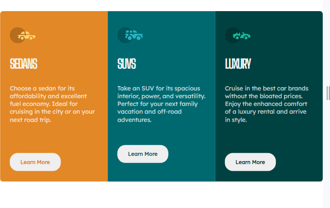

# Frontend Mentor - 3-column preview card component solution

This is a solution to the [3-column preview card component challenge on Frontend Mentor](https://www.frontendmentor.io/challenges/3column-preview-card-component-pH92eAR2-). Frontend Mentor challenges help you improve your coding skills by building realistic projects. 

## Table of contents

- [Frontend Mentor - 3-column preview card component solution](#frontend-mentor---3-column-preview-card-component-solution)
  - [Table of contents](#table-of-contents)
  - [Overview](#overview)
    - [The challenge](#the-challenge)
    - [Screenshot](#screenshot)
    - [Links](#links)
  - [My process](#my-process)
    - [Built with](#built-with)
    - [What I learned](#what-i-learned)
    - [Continued development](#continued-development)
  - [Author](#author)
  - [Acknowledgments](#acknowledgments)

## Overview

### The challenge

Users should be able to:

- View the optimal layout depending on their device's screen size
- See hover states for interactive elements

### Screenshot

!
A screenshot of my solution.
### Links

- Solution URL: [Add solution URL here](https://your-solution-url.com)
- Live Site URL: [Add live site URL here](https://your-live-site-url.com)

## My process

### Built with

- Semantic HTML5 markup
- CSS custom properties
- Flexbox
- Mobile-first workflow
- For styles
- ** Used for of utility classes for my css  **

**Note: These are just examples. Delete this note and replace the list above with your own choices**

### What I learned

I learned to use css flexbox well and also create css utility classes to be re-useable for other project, still getting a hang of it sha.

*

### Continued development

I wanna to really work on my uses of flexbox more and also learn how to use clamp , min, and max properties to reduce changing some propertoe for the  media query 

Still learning Javascript , and i really  wanna solve nd create more projects

## Author

- Website - [Add your name here](https://www.your-site.com)
- Frontend Mentor - [@yourusername](https://www.frontendmentor.io/profile/Prayhaiz)
- Twitter - [@yourusername](https://twitter.com/ErasmusOluwato1)

## Acknowledgments

I wanna thank Kelvin powell once again for giving detailed guides on how to use css flexbox , Thank You.
And i also wanna gibe credit to an article i read that helped in solving my delayed time in finishing projects , thanks fo the guides and help , am looking forward to working on more projects and scoring more points on FrontenMentor

*
